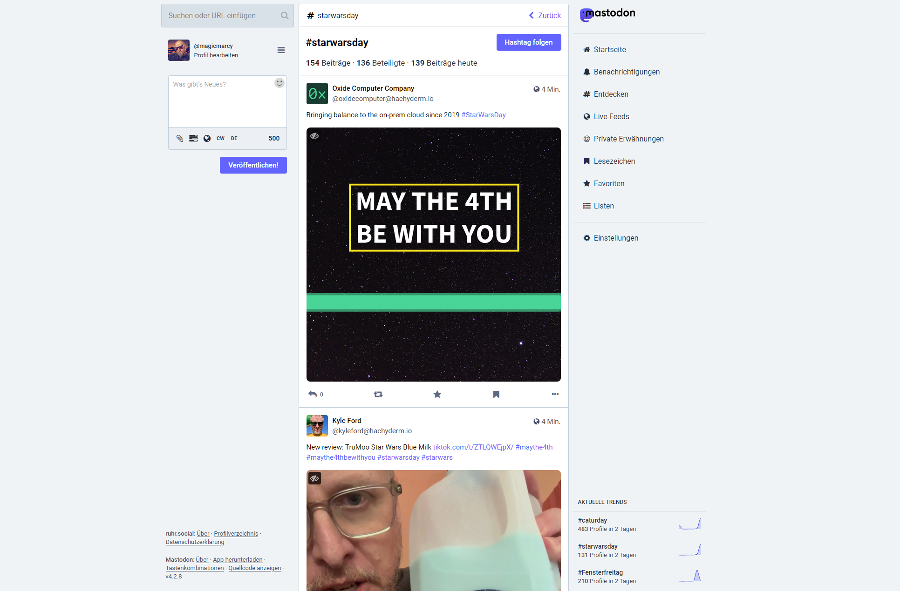
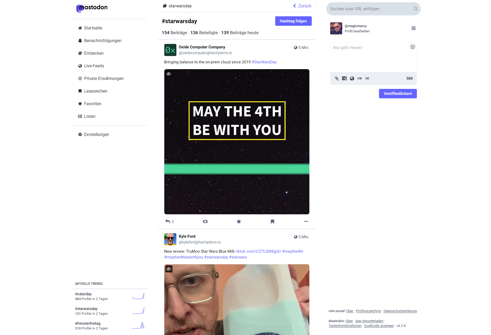

# mastodon-design (DE)
Custom CSS für Mastodon v4.2.8

Hier findest du ein Custom-Design für die Weboberfläche deiner Mastodon-Instanz. Das Design kannst du z.B. mit Tampermonkey oder Greasymonkey einfach als Script hinzufügen. Lediglich die URL bei "match" musst du auf deine Instanz anpassen.

Du kannst das CSS aber auch allein verwenden, falls du anderen Möglichkeiten hast, eigenes CSS in die Seite einzufügen.

Bitte beachte, dass ich das Ganze auf mein eigenen Bedürfnisse in meiner Instanz (ruhr.social) angepasst habe. Sollte in deiner Instanz bereits ein anderes CSS genutzt werden wird hier eingesetzte CSS vermutlich keine Verbesserung bringen.

Gerne kannst du an diesem Projekt mitarbeiten und helfen, dieses Script zu verbessern oder weiterzuentwickeln oder das Script für dich nach deinen Bedürfnissen anpassen.

### Wichtig!
Dieses CSS ist ausschließlich für die Verwendung des Standard-Themes (light) vorgesehen und auch nicht bei der Verwendung der "verbesserten Weboberfläche".

# mastodon-design (EN)
Custom CSS for Mastodon v4.2.8

Here you can find a custom theme for the web interface of your Mastodon instance. You can easily add the design as a script using Tampermonkey or Greasymonkey for example. You just need to change the URL for "match" to match your instance.

However, you can also use the CSS on its own if you have other ways of inserting your own CSS into the page.

Please note that I have adapted the whole thing to my own needs in my instance (ruhr.social). If your instance already uses a different CSS, the CSS used here will probably not bring any improvement.

You are welcome to contribute to this project and help improve or develop this script or customize it to your needs.

### Important!
This CSS is only intended for use with the default theme (light) and not when using the "enhanced web interface".

## VORHER / BEFORE

## NACHHER / AFTER

